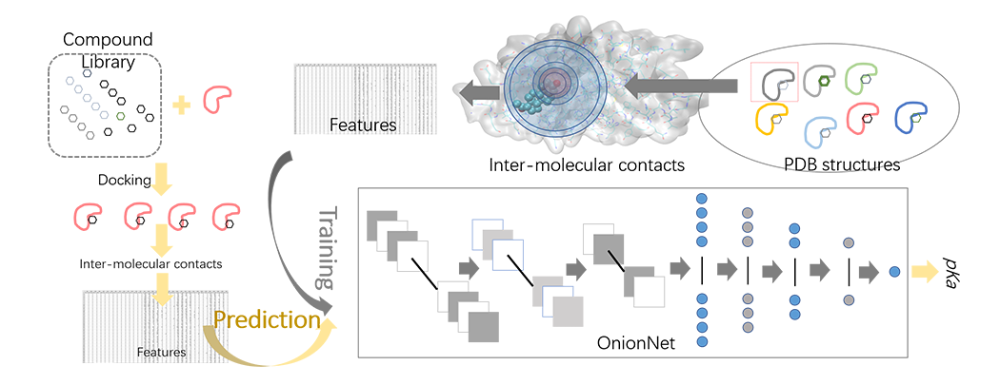

# OnionNet
A multiple-layer inter-molecular contact based deep neural network for protein-ligand binding affinity prediction. The testing set is CASF-2013 benchmark. The protein-ligand binding affinity is directly predicted.

The model could be applied for re-scoring the AutoDock Vina results.

## Contact

Yuguang Mu, Nanyang Technological University, ygmu_AT_ntu.edu.sg

Liangzhen Zheng, Nanyang Technological University, lzheng002_AT_e.ntu.edu.sg

## Citation
Coming soon ... ...

## Installation
Necessary packages should be installed to run the OnionNet model.

Dependecies:

    python >= 3.6
    numpy  
    scipy  
    pandas 
    scikit-learn
    mpi4py
    mdtraj 
    tensorflow

To install necessary environment, create a new env with conda commands
   
    # download the package and then enter the folder
    git clone https://github.com/zhenglz/onionnet.git
    cd onionnet

    # create a new pearsonal conda environment
    conda env create -f onionnet_environments.yml 
    conda activate onionnet
    
    # do some tests now
    python generate_features.py -h
    python predict_pKa.py -h

## Usage
### 1. Prepare the protein-ligand complexes (3D structures) in pdb format
    
    a. The protein-ligand complexes from experimental crystal or NMR structures, or from molecular
       docking, are accepted.
    b. Make sure that the residue name of the ligands is the same, preferable "LIG" or "UNK".
    c. Generate an file containing the complexes, one complex per line. Each line contains the 
       path of the protein-ligand complex file.

### 2. Generate multiple-layer inter-molecular contact features
Using the "generate_features.py" script to generate the features for OnionNet predictions.
 
    python generate_features.py -h
    python generate_features.py -inp input_complexes.dat -out output_features.csv

    # or run the script with MPI, cpu 4 cores
    mpirun -np 4 python generate_features.py -inp input_complexes.dat -out output_features.py 

The input file contatins the absolute or relative pathes of the protein-ligand complexes pdb files.
The content of the "input_complexes.dat" file could be:
 
    ./10gs/10gs_complex.pdb
    ./1a28/1a28_complex.pdb

Or:
  
    /home/liangzhen/PDBBind_v2018/10gs/10gs_dockingpose.pdb
    /home/liangzhen/PDBBind_v2018/1a28/1a28_dockingpose.pdb

### 3. Predict the pKa of the complexes
Given a dataset containing the multiple-layer inter-molecular contact features, we could predict
the binding affinities (in pKa scale). 

    python predict_pKa_HFree.py -h
    python predict_pKa_HFree.py -model OnionNet_HFree.h5 -scaler StandardScaler_OnionNet.model -inp features.csv -out output_predicted_pKa.csv

